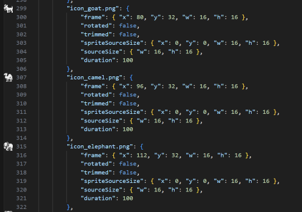
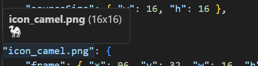

# Sprite Sheet Preview for VS Code

This extension adds icon sprite previews to your JSON sprite sheet definitions (Aseprite / TexturePacker Hash or Array format).

## Features

-   **Gutter Icons:** Shows a small preview of the sprite frame in the editor gutter next to the frame definition.

    

-   **Hover Preview:** Hover over the frame key (hash format) or filename (array format) to see a larger, full-size preview of the sprite.

    

## Usage

1. Open a JSON file that describes a sprite sheet (e.g., exported from Aseprite).
2. Ensure the referenced image (in `meta > image`) exists relative to the JSON file.
3. You will see sprite icons in the gutter next to each frame definition. Hover over the key/filename to see the full-size preview.

## Configuration

-   `spritePreview.thumbnailSize`: Set the size (height) of the preview image shown in the hover tooltip (default: full size).
-   `spritePreview.backgroundColor`: Set the background color of the preview image (default: transparent).
    -   Useful if there is insufficient contrast between your VS Code theme and your sprite.

## Requirements

The JSON file must follow the standard Hash or Array format:

**Hash Format:**

```json
{
  "frames": {
    "icon.png": {
      "frame": { "x": 0, "y": 0, "w": 16, "h": 16 },
      ...
    }
  },
  "meta": { ... }
}
```

**Array Format:**

```json
{
  "frames": [
    {
      "filename": "icon.png",
      "frame": { "x": 0, "y": 0, "w": 16, "h": 16 },
      ...
    }
  ],
  "meta": { ... }
}
```
